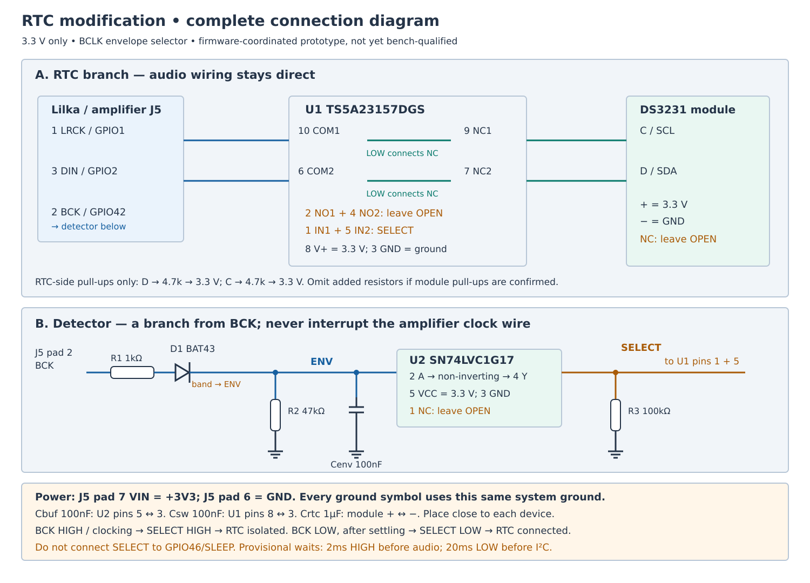
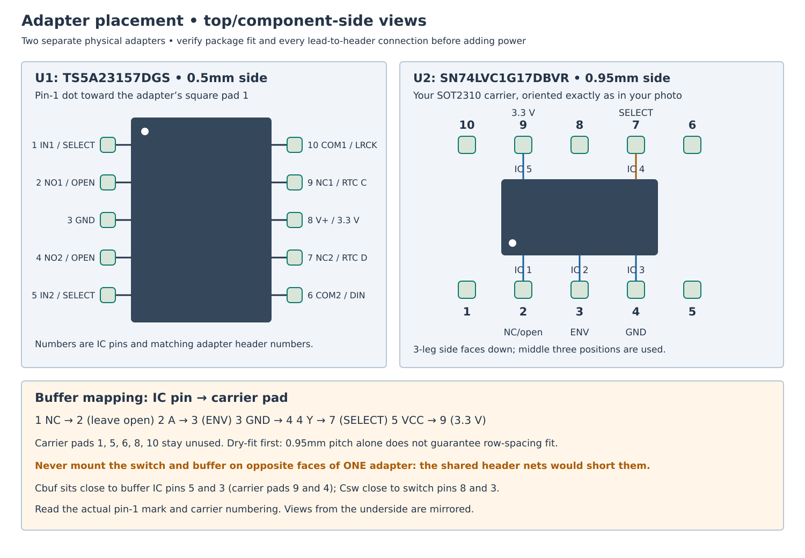
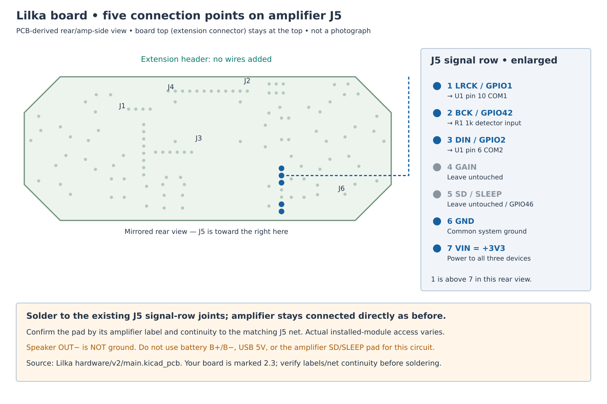

Battery-backed RTC over multiplexed audio pins
==============================================

Status and authoritative wiring guide
-------------------------------------

Updated 2026-10-09: the selected hardware design uses a BCLK envelope detector
and non-inverting Schmitt buffer to select the RTC branch. This replaces the
original GPIO46/SLEEP selector, which conflicts with the modified board's PWM
backlight. No firmware implementation or hardware qualification has happened.

The complete parts list, pin-by-pin netlist, assembly checks and editable
connection diagrams are in `RTC wiring guide <rtc-wiring/README.md>`_.
A standalone browser document is available at
`RTC wiring sheets <rtc-wiring/rtc-wiring.html>`_.

Goals and scope
---------------

* Preserve every extension-header pin, UART, buttons, piezo buzzer, PWM
  backlight, display, SD and direct MAX98357 I2S wiring.
* Keep RTC time while the mechanical power switch is off.
* Read valid RTC UTC during early boot before normal I2S initialization.
* Write UTC after explicit manual time changes or trusted NTP initialization
  of an invalid RTC; do not continuously poll or rewrite a valid RTC.
* Apply the configured time zone only when displaying UTC-derived local time.
* Electrically isolate RTC SDA/SCL from I2S traffic during audio playback.

RTC alarms, power-off wake, square-wave/32 kHz outputs and periodic drift
correction are out of scope for the first implementation.

Selected hardware
-----------------

Use DS3231SN module, TS5A23157DGS dual SPDT switch, SN74LVC1G17DBVR
non-inverting Schmitt buffer and BAT43 Schottky diode. Each IC needs its own
physical adapter. A two-sided carrier is not two electrically separate boards.

Five additional wires branch from amplifier connector J5:

* pad 1 LRCK / GPIO1 to switch pin 10 COM1;
* pad 2 BCK / GPIO42 to the detector's 1 kohm input resistor;
* pad 3 DIN / GPIO2 to switch pin 6 COM2;
* pad 6 GND to common circuit ground;
* pad 7 VIN, which is +3V3 on Lilka, to circuit supply.

Leave amplifier wiring direct and unchanged. Do not use speaker OUT- as ground.
Do not connect this circuit to USB 5 V, battery pads, GPIO46/SLEEP, extension
pins or the buzzer. Preserve the existing amplifier-SD isolation modification.

Switch pin 9 NC1 connects to module C/SCL; pin 7 NC2 to module D/SDA.
NO1 pin 2 and NO2 pin 4 are unused and left open. Switch pin 8 is +3V3;
pin 3 is GND. IN1 pin 1 and IN2 pin 5 are tied to SELECT from buffer output.
LOW selects NC/RTC; HIGH selects unused NO/RTC isolated.

Module labels supplied by Anton are ``+ D C NC -``: 3.3 V, SDA, SCL,
no connection, GND. Module NC does not mean a normally-closed switch contact.

Detector topology::

    GPIO42/BCK -- R1 1k -- BAT43 anode
                             cathode/band -- ENV -- U2 pin 2 A
                                               |-- R2 47k -- GND
                                               `-- Cenv 100nF -- GND

    U2 pin 4 Y -- SELECT -- U1 pins 1 + 5
                    `-- R3 100k -- GND

U2 is SN74LVC1G17DBVR: pin 1 NC open, pin 2 A input, pin 3 GND,
pin 4 Y output, pin 5 VCC +3V3. Use a non-inverting buffer, not 1G14.
BAT43's band faces ENV. Do not put R1 in series with the amplifier clock wire.

Power decoupling uses three separate 100 nF capacitors: Cenv envelope,
Cbuf across buffer pins 5/3, and Csw across switch pins 8/3. Add 1 uF near
RTC +/-. Supply decoupling must sit close to each device. Keep SDA/SCL
4.7 kohm pull-ups on the RTC side; add only if module pull-ups are absent.
Verify the module's backup-cell chemistry and any external charging circuitry.

Selection behavior
------------------

BCK deliberately held HIGH, or running a qualified continuous I2S clock,
charges ENV and produces SELECT HIGH: RTC isolated. BCK held LOW allows ENV
to discharge and produces SELECT LOW: RTC connected after settling.

A plain RC average of a 50% clock is insufficient for the analog switch's
HIGH threshold. The peak detector and Schmitt buffer are required.
Nominal ENV is approximately 2.85 V under continuous clocks; nominal release
time constant is 4.7 ms. These model values do not guarantee operation over
voltage, temperature, capacitor tolerance, GPIO loading or leakage.

Boot/reset/transition selection is not assumed safe automatically. Shared
GPIO1/2 must remain quiet until the coordinator establishes the needed state.
Existing firmware is not compatible with this hardware installation.

Mandatory firmware ownership and sequencing
------------------------------------------

One coordinator owns RTC transactions, GPIO1/2/42 mode transitions and the
shared RTC/audio mutex. Applications must not independently start I2C or I2S
on these pins. Every SDK, Lilplayer, guest/direct-I2S, pause/resume, sleep/wake
and error path must follow the contract.

Before audio starts or resumes:

1. Acquire ownership and finish/stop I2C.
2. Stop/detach conflicting peripheral routing and keep GPIO1/2 quiet/safe.
3. Drive GPIO42/BCK HIGH as GPIO.
4. Wait provisionally 2 ms for isolation; bench measurements must qualify it.
5. Start I2S without a LOW hand-off interval long enough to release SELECT.

Before RTC access:

1. Defer active-audio writes unless the audio owner supports coordinated stop.
2. Stop/detach I2S; make GPIO1/2 safe/high-impedance.
3. Drive GPIO42/BCK LOW as GPIO.
4. Wait provisionally 20 ms for release and bus settling.
5. Start 100 kHz I2C: SDA GPIO2, SCL GPIO1, address 0x68.
6. Perform bounded read/write, stop I2C and return GPIO1/2 to safe state.
7. Re-isolate with the HIGH sequence before restoring audio.

First I2S clock edges are not sufficient pre-isolation. Audit GPIO42 reset,
JTAG and peripheral default states. Quiet GPIO1/2 must include the effects of
pull-up-driven level changes during switch reconnection. Verify no unintended
RTC transactions and no audible clicks during all transitions.

Time validity and policy
------------------------

DS3231 validity uses both oscillator-stop flag OSF and bounded calendar fields
after BCD conversion. Clear OSF only after a successful trusted-time write and
readback. A plausible year alone is insufficient.

Read valid RTC UTC early and initialize the system clock. Missing RTC, invalid
data or I2C timeout must not block boot: retain the existing unsynchronized
behavior until manual/NTP time becomes available.

Manual changes update system and RTC UTC, then verify readback. Trusted NTP
initializes an invalid RTC once, not on every poll. Time-zone changes never
rewrite RTC UTC. Periodic drift correction remains deferred.

Qualification and implementation phases
---------------------------------------

Phase 0: prove hardware separately before installation. Verify exact carrier
pin mappings, supply isolation, diode direction, pull-ups and switch truth
table. Use a scope for ENV/BCK analog levels and loading; a logic analyzer
alone cannot prove analog margin. Prove pre-isolation before the first audio
edge, RTC-side quiet during I2S and selection settling before I2C.

Phase 1: implement shared SDK/audio coordinator and bounded early RTC read.
Missing/invalid RTC must fail open; all normal boot/download modes must work.

Phase 2: implement manual and first-trusted-NTP writes with readback and
coordinated deferral during audio. Preserve UTC through hard power-off.

Phase 3: exercise every player/guest/direct-I2S path and startup, pause/resume,
sleep/wake, driver error and reset. Verify clean audio and no unintended RTC
traffic. Qualify settling waits across relevant clocks and supply conditions.

Validation includes Wi-Fi-free cold boot, absent RTC, stopped oscillator,
manual/NTP writes, no repeated valid-RTC writes, unchanged UTC after timezone
change, at least 24 h backup retention, twenty transaction cycles, audio
ownership/error recovery, no pin conflicts and no regressions to brightness,
buzzer, extension header or USB download mode.

Repository ownership
--------------------

Keira RTC service, clock/NTP integration, manual-time policy and UI belong to
``feature/rtc-support``. Generic SDK audio ownership and pin hand-offs belong
in a companion SDK feature branch. Merge only after electrical proof and the
appropriate implementation checks. Firmware builds and flashing are separate
from this documentation-only task and require Anton's explicit request.
